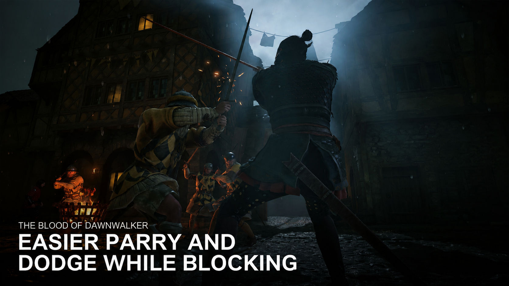

# Easier Parry - UE4SS



Makes parrying more forgiving in *The Blood of Dawnwalker* by multiplying Coen's parry timing window.

- **2× timing window** by default, configurable from **0.1× to 50×**.
- Uses the game's current, difficulty-adjusted timing as its baseline.
- Caches the player and parry attribute; healthy checks do not scan game objects.
- Checks once per second by default and writes only when the value changes.
- Reacquires invalid player/attribute references after loading or recreation.
- Optional dodge interruption of active guard, enabled in the shipped defaults.

## Installation

Requires a Dawnwalker-compatible **UE4SS 3.x** installation.

Download the mod ZIP from [Releases](https://github.com/my-mods/Easier-Parry-UE4SS/releases), install it through Vortex, then enable and deploy.

The ZIP includes Vortex metadata, the changelog, and release notes. Nexus listing materials are maintained separately in the repository’s [Nexus folder](Nexus/README.txt).

For updates, close the game and replace/reinstall the existing mod entry from the new ZIP, then deploy through Vortex. Use the UE4SS (Lua mods) type. Keep one enabled Easier Parry entry.

The ZIP ships EasierParryUE4SS.defaults.ini only. Your personal EasierParryUE4SS.ini is stored under %LOCALAPPDATA%/Dawnwalker/Saved/Config, outside Vortex's deployment, and is not included in updates.

To uninstall, disable/remove the mod in Vortex, deploy, and restart the game. Your personal INI remains available for reinstalling; delete it yourself only if you want to reset your preferences.

## Configuration

Personal settings live here:

`%LOCALAPPDATA%/Dawnwalker/Saved/Config/EasierParryUE4SS.ini`

The mod reads the shipped EasierParryUE4SS.defaults.ini first, then applies your personal overrides. Omitted/commented keys inherit the current defaults. Existing user files are never rewritten at startup. Updates replace only shipped defaults; explicit user overrides continue to win.

A first launch creates a user INI with commented examples if it is missing. Edit only the settings you want to override, for example:

```ini
[General]
dodgeInterruptsGuard = true
factor = 3.0
```

Shipped defaults are enabled = true, factor = 2.0, pollMilliseconds = 1000, debugLogging = false, and dodgeInterruptsGuard = true. The factor range remains 0.1 to 50.0. All settings can be overridden under [General].

The two files are loaded once at startup. Restart after direct INI edits; death and save loading do not reread them. UTF-8 files with or without a BOM are supported. Invalid numeric overrides keep their inherited value. If the personal file cannot be read or created, the mod logs the path and stops until the problem is fixed and the game restarted; it never falls back to writing a Vortex-managed INI.

Console commands save only the settings they change in the personal file: a numeric factor also enables the mod, on/off changes enabled, and dodge on/off changes dodgeInterruptsGuard. Comments, unrelated keys and sections are preserved. A failed save leaves the selection active for the session and logs the failure. Shipped defaults are never written by the mod.

When upgrading from an older package with an editable INI inside the mod, copy that file to the personal path before replacement if no user file exists. The mod also copies a legacy INI on first startup if it is still present and no user file exists. An existing personal file always takes precedence.

## Dodge interrupts guard

Enable dodgeInterruptsGuard to release active guard just before a normal dodge attempt. The shipped defaults enable it; a personal false override disables it. Use easierparry dodge on to enable it immediately, or set dodgeInterruptsGuard = true under [General] in your personal INI and restart. Use easierparry dodge off to restore vanilla behavior. The toggle is saved and does not change the parry factor. The master enabled setting controls both features.

The option drops guard; release and press guard again to raise it afterward. A dodge attempt still follows the game's normal eligibility, stamina and animation rules, so an unsuccessful attempt can also leave guard lowered. No keys are hardcoded, so the feature follows the game's dodge action with keyboard or remapped controller controls. Live gameplay validation is pending.

## Console commands

- `easierparry status` — show the selected factor, baseline, target timing and dodge option status.
- `easierparry 3` — select a 3× multiplier, enable the mod and save the selection.
- `easierparry off` / `easierparry on` — disable/enable the mod and save the selection.
- `easierparry dodge on` / `easierparry dodge off` — enable/disable and save guard interruption.

To check that the mod is active, load a save and look for `[EasierParryUE4SS] Applied` in `ue4ss/UE4SS.log`.

## Compatibility

Targets Steam build **25129649 / CL-257186**. Replaces no game assets; may conflict with other mods that alter guard/dodge behavior or change `ParryWindowMultiplier`.

Created by **oOCamilleOo**. [MIT license](LICENSE).
